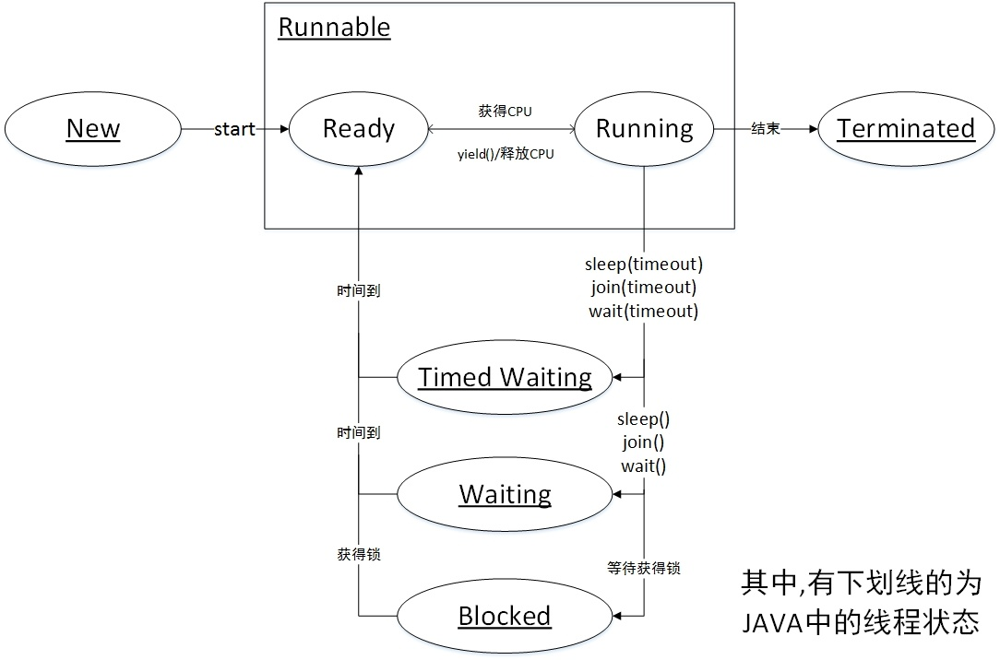

https://www.cnblogs.com/aspirant/p/8876670.html

#### sleep/yield/join/wait

只有runnable到running时才会占用cpu时间片，其他都会出让cpu时间片；线程的资源有不少，但应该包含CPU资源和锁资源这两类。
sleep(long mills)：让出CPU资源，但是不会释放锁资源。如果线程进入sleep的话，释放cpu资源，如果外层包有Synchronize，那么此锁并没有释放掉

yield()：让出CPU调度，yield()方法只能让同优先级的线程有执行的机会。 yield()只是使当前线程重新回到可执行状态，所以执行yield()的线程有可能在进入到可执行状态后马上又被执行

join()：当前运行线程调用另一个线程的join方法，当前线程进入阻塞状态直到另一个线程运行结束等待该线程终止。如：t.join();//主要用于等待t线程运行结束，若无此句，main则会执行完毕，导致结果不可预测。

wait()：让出CPU资源和锁资源。会使得当前线程暂停执行并释放对象锁标志，让其他线程可以进入Synchronized数据块，当前线程被放入对象所关联的锁monitor的waitset等待池中

Thread方法：Thread.sleep(long)、Thread.yield()、join()非静态

```java
public class Thread implements Runnable {
    
    private Runnable target;
    
    @Override
    public void run() {
        if (target != null) {
            target.run();
        }
    }
    
    public static native void yield();
    
    //sleep方法实现
    public static native void sleep(long millis) throws InterruptedException;
    
    public static void sleep(long millis, int nanos)
    throws InterruptedException {
        if (millis < 0) {
            throw new IllegalArgumentException("timeout value is negative");
        }
        if (nanos < 0 || nanos > 999999) {
            throw new IllegalArgumentException(
                                "nanosecond timeout value out of range");
        }
        if (nanos >= 500000 || (nanos != 0 && millis == 0)) {
            millis++;
        }
        //调用native方法
        sleep(millis);
    }
    
    
    public final void join() throws InterruptedException {
        join(0);
    }
    
    //join方法实现
    public final synchronized void join(long millis)
    throws InterruptedException {
        long base = System.currentTimeMillis();
        long now = 0;

        if (millis < 0) {
            throw new IllegalArgumentException("timeout value is negative");
        }

        if (millis == 0) {
            while (isAlive()) {
                wait(0);
            }
        } else {
            while (isAlive()) {
                long delay = millis - now;
                if (delay <= 0) {
                    break;
                }
                wait(delay);
                now = System.currentTimeMillis() - base;
            }
        }
    }
    
    
    public final synchronized void join(long millis, int nanos)
    throws InterruptedException {

        if (millis < 0) {
            throw new IllegalArgumentException("timeout value is negative");
        }

        if (nanos < 0 || nanos > 999999) {
            throw new IllegalArgumentException(
                                "nanosecond timeout value out of range");
        }

        if (nanos >= 500000 || (nanos != 0 && millis == 0)) {
            millis++;
        }

        join(millis);
    }

}
```

java.lang.Object方法：Object.wait()、Object.notify()、Object.notifyAll() ......这些方法只能在同步代码块中调用

```java
public class Object {
    
    public boolean equals(Object obj) {
        return (this == obj);
    }
    
    public String toString() {
        return getClass().getName() + "@" + Integer.toHexString(hashCode());
    }

    protected void finalize() throws Throwable { }
    
    
    private static native void registerNatives();
    static {
        registerNatives();
    }
    
    public final native Class<?> getClass();
    
    public native int hashCode();
    
    protected native Object clone() throws CloneNotSupportedException;
    
    //随机唤醒等待队列中的一个线程，让它进入同步队列
    public final native void notify();

    //全部唤醒等待队列中的线程，全部进入同步队列
    public final native void notifyAll();
    
    //wait实现
    public final native void wait(long timeout) throws InterruptedException;
    
    public final void wait(long timeout, int nanos) throws InterruptedException {
        if (timeout < 0) {
            throw new IllegalArgumentException("timeout value is negative");
        }
        if (nanos < 0 || nanos > 999999) {
            throw new IllegalArgumentException(
                                "nanosecond timeout value out of range");
        }
        if (nanos > 0) {
            timeout++;
        }
        //调用native
        wait(timeout);
    }
    
    
    public final void wait() throws InterruptedException {
        wait(0);
    }
    
}
```

它们用于协调多个线程对共享数据的存取，必须在synchronized语句块内使用这三个方法。前面说过synchronized这个关键字用于保护共享数据，阻止其他线程对共享数据的存取，但是这样程序的流程就很不灵活了，如何才能在当前线程还没退出Synchronized数据块时让其他线程也有机会访问共享数据？此时就用这三个方法来灵活控制。

#### java线程


+ 初始状态(NEW)：实现Runnable接口和继承Thread可以得到一个线程类，new一个实例出来，线程就进入了初始状态，还没有调用start()方法
+ 就绪/运行中状态(RUNNABLE—READY、RUNNING)：线程对象创建后，其他线程(比如main线程）调用了该对象的start()方法。该状态的线程位于可运行线程池中，等待被线程调度选中，获取CPU的使用权，此时处于就绪状态（ready）。就绪状态的线程在获得CPU时间片后变为运行中状态（running）
+ 阻塞状态(BLOCKED)：线程阻塞在进入synchronized关键字修饰的方法或代码块(获取锁)时的状态
+ 等待(WAITING)：进入该状态的线程需要等待其他线程做出一些特定动作（通知或中断）,等待被显式地唤醒，否则会处于无限期等待的状态。
+ 超时等待(TIMED_WAITING)：处于这种状态的线程不会被分配CPU执行时间,在达到一定时间后它们会自动唤醒
+ 终止状态(TERMINATED)：表示该线程已经执行完毕

```java
public class Thread implements Runnable {
public enum State {
       
        NEW,
    
        RUNNABLE,
    
        BLOCKED,

        WAITING,

        TIMED_WAITING,

        TERMINATED;
    }

}
```

